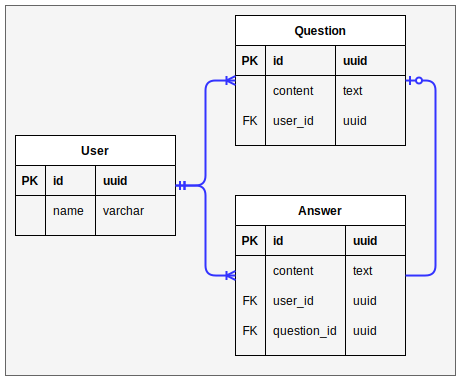

# Question Answer Service

REST Service for questions and answers

## Database modeling



## Directory tree

- `pkg`: Here is the main source code.
- `sql`: Here are all the SQL files to create the tables, data insertions and methods (it is not necessary run these files manually).
- `postman`: Here is a `json` file to import to your local Postman.

# 1. Requirements

| Software         | Version | Importance                   |
| ---------------- | ------- | ---------------------------- |
| 🐳 Docker         | 20.10.11 | Required                     |
| 🐙 Docker Compose | 1.24.1  | Required                     |
| 🐃 GNU Make       | 4.2.1   | Optional                     |
| ‍🚀 Postman        | 9.1.5   | Optional                     |


# 2. Prepare the environment file (.env)

1. Copy the `.env-example` file to `.env` file:

```shell
cp .env-example .env
```

2. Fill out the variables with your own credentials. If you want to start quickly, 
these are the default values (do not modify):
```
API_PORT=8087

POSTGRES_DB=qas_db
POSTGRES_USER=qas
POSTGRES_PASSWORD=secret
POSTGRES_DRIVER=postgres
POSTGRES_HOST=qas_pgsql
```

# 3. Run the service
1. Execute the command `make l/up`. Or, if you are on _Windows_ execute:
```shell
docker-compose down --remove-orphans --rmi all
```
and
```shell
docker-compose up --detach --remove-orphans --force-recreate --build
```

> 
> The queries at `.sql/` directory run with the `docker-composer` command (lines 21, 22), 
> so it **is not necessary** run separately. (make sure that the API_PORT is 8087)
> 

2. Finally, you can run the command, the output should be an array with all the questions.
```shell
curl http://127.0.0.1:8087/question
```

# 4. Testing using postman

- You can import the **collection** file at `./postman/collection.json`
- You can import the **environment** file at `./postman/environment.json`